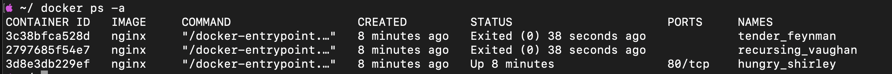
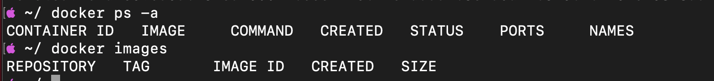
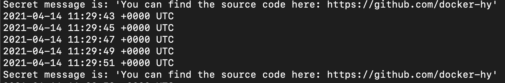
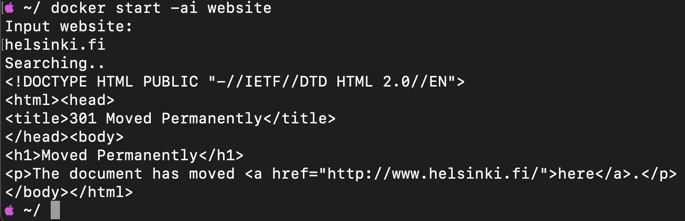
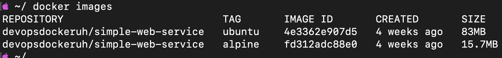
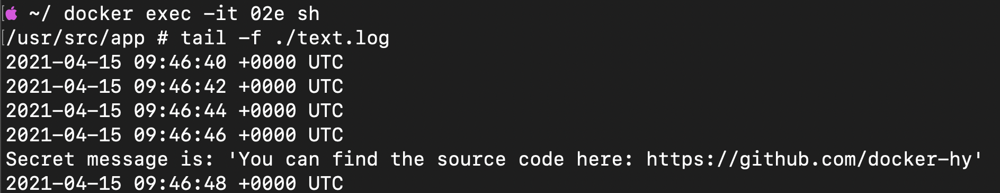
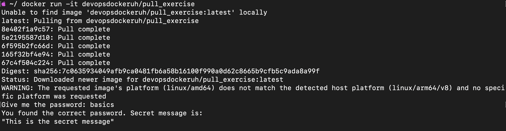
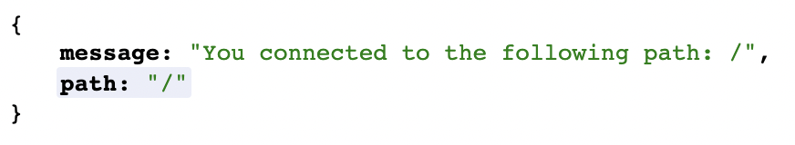

# 1.1 Getting Started

```sh
docker container run -d nginx <- run 3 times
docker container stop 3c38 2797
docker ps -a
```



# 1.2 Clean Up

```sh
docker container stop 3d8c
docker container rm 2797 3d8e 3c38
docker image rm nginx
```



# 1.3 Secret Message

```sh
docker run -d -it --name secret-msg devopsdockeruh/simple-web-service:ubuntu

docker exec -it secret-msg bash

# Inside container
tail -f ./text.log

# Secret message
Secret message is: 'You can find the source code here: https://github.com/docker-hy'
```



# 1.4 Missing dependencies

```sh
docker run -d -it --name website ubuntu sh -c 'echo "Input website:"; read website; echo "Searching.."; sleep 1; curl http://$website;'

# Go inside ubuntu container to install curl
docker exec -it website bash
# Inside container
apt-get update
apt-get install curl
# Exit container
exit
# Start container
docker start -ai website
input: helsinki.fi
```



# 1.5 Sizes of images

```sh
docker pull devopsdockeruh/simple-web-service:ubuntu

docker pull devopsdockeruh/simple-web-service:alpine

docker images
ubuntu size: 83MB
alpine size: 15.7MB
```



```sh
docker run -d -it fd31
docker exec -it 02e sh
# Inside container
tail -f ./text.log
```



# 1.6 Hello Docker Hub



# 1.7 Two line Dockerfile

[Dockerfile](./1.7/Dockerfile)

```sh
docker build . -t web-server
docker run web-server
```

# 1.8 Image for script

[Dockerfile](./1.8/Dockerfile)

```sh
docker build . -t ubuntu:curler
docker run -it ubuntu:curler
```

# 1.9 Volumes

```sh
mkdir logs && touch logs/text.log && docker run -v $(pwd)/logs/text.log:/usr/src/app/text.log devopsdockeruh/simple-web-service:ubuntu
```

# 1.10 Ports open

[Same Dockerfile from 1.7](./1.7/Dockerfile)

```sh
docker build . -t web-server
docker run -p 8080:8080 web-server
```



# 1.11 Spring

[Dockerfile](./1.11/Dockerfile)

```sh
docker build . -t spring
docker run -p 8080:8080 spring
```

# 1.12 Hello, frontend!

[Dockerfile](./1.12/Dockerfile)

```sh
docker build . -t example-frontend
docker run -p 5000:5000 example-frontend
```

# 1.13 Hello, backend!

[Dockerfile](./1.13/Dockerfile)

```sh
docker build . -t example-backend
docker run -p 8080:8080 example-backend
```

# 1.14 Environment

[Dockerfile frontend](./1.14/frontend/Dockerfile) -
[Dockerfile backend](./1.14/backend/Dockerfile)

```sh
# Frontend
docker build . -t example-frontend
docker run -p 5000:5000 example-frontend
# Backend
docker build . -t example-backend
docker run -p 8080:8080 example-backend
```

# 1.15 Homework

[Link to Docker Hub](https://hub.docker.com/r/muugmaster/covid-tracker-react)

# 1.16 Heroku

[Link to App](https://docker-test-niko.herokuapp.com/)
